題目：平衡負載、容錯機制的建置  
  
目標：(1) 使用 HAProxy (web0)建置 HTTP 的平衡負載、容錯機制  
 (2) 後端 x2 (web1、web2)使用 Nginx  
  
驗證：(1) 使用Client端的瀏覽器輸入 http://xxx.xxx.xxx.xxx (web0)自動跳轉負載較輕的後端伺服器(web1 or web2)  
 (2-1) 於內部使用壓力測試軟體(http_load、webbench、ab)致使 web1 或 web2 處於高負載  
 (2-2) 使用Client端的瀏覽器輸入 http://xxx.xxx.xxx.xxx (web0)自動跳轉負載較輕的後端伺服器  
 (3) 後端 (web1 or web2) 其中一台失能(關機、斷網、服務失效)，Client端依然可以於 web0 正常顯示  
  
內容：闡述原理、優缺點、實行步驟...

-----


一、基礎介紹

- <https://www.haproxy.org/> （官方網站）

- <https://www.haproxy.org/download/1.8/src/haproxy-1.8.14.tar.gz>（下載地址）

- <http://cbonte.github.io/haproxy-dconv/1.8/configuration.html>（文檔Haproxy 1.8 文檔）

     HAProxy提供高可用性、負載均衡以及基於TCP和HTTP應用的代理，支持虛擬主機，它是免費、快速並且可靠的一種解決方案。 HAProxy特別適用於那些負載特大的web站點，這些站點通常又需要會話保持或七層處理。 HAProxy運行在當前的硬件上，完全可以支持數以萬計的並發連接。並且它的運行模式使得它可以很簡單安全的整合進您當前的架構中， 同時可以保護你的web服務器不被暴露到網絡上。

     HAProxy實現了一種事件驅動, 單一進程模型，此模型支持非常大的並發連接數。多進程或多線程模型受內存限制 、系統調度器限制以及無處不在的鎖限制，很少能處理數千並發連接。事件驅動模型因為在有更好的資源和時間管理的用戶空間(User-Space) 實現所有這

二、負載平衡的類型

    （1）無負載平衡：沒有負載平衡的簡單Web應用程序環境可能如下所示


      在此示例中，用戶直接連接到您的Web服務器，在_yourdomain.com上，_並且沒有負載平衡。如果您的單個Web服務器出現故障，用戶將無法再訪問您的Web服務器。此外，如果許多用戶試圖同時訪問您的服務器並且無法處理負載，他們可能會遇到緩慢的體驗，或者可能根本無法連接。

（2）4層負載平衡： 

     將網絡流量負載平衡到多個服務器的最簡單方法是使用第4層（傳輸層）負載平衡。以這種方式進行負載均衡將根據IP範圍和端口轉髮用戶流量（即，如果請求進入​ [​_http://yourdomain.com/anything_​](http://www.baipisong.net.cn/)​，則流量將轉發到處理_yourdomain.com的_所有請求的後端。_端口80_）。


     用戶訪問負載均衡器，負載均衡器將用戶的請求轉發給後端服務器的_Web後端_組。無論選擇哪個後端服務器，都將直接響應用戶的請求。通常，_Web後端_中的所有服務器應該提供相同的內容 - 否則用戶可能會收到不一致的內容。

（3）7層負載平衡：

      7層負載平衡是更複雜的負載均衡網絡流量的方法是使用第7層（應用層）負載均衡。使用第7層允許負載均衡器根據用戶請求的內容將請求轉發到不同的後端服務器。這種負載平衡模式允許您在同一域和端口下運行多個Web應用程序服務器。


    示例中，如果用戶請求_yourdomain.com/blog_，則會將其轉發到_博客_後端，後端是一組運行博客應用程序的服務器。其他請求被轉發到_web-backend_，_後端_可能正在運行另一個應用程序。


HAProxy配置文件(/etc/haproxy/haproxy.cfg)詳解：

```
global   # 全局參數的設置
    log 127.0.0.1 local0 info
    # log語法：log <address_1>[max_level_1] # 全局的日誌配置，使用log關鍵字，指定使用127.0.0.1上的syslog服務中的local0日誌設備，記錄日誌等級為info的日誌
    user haproxy
    group haproxy
    # 設置運行haproxy的用戶和組，也可使用uid，gid關鍵字替代之
    daemon
    # 以守護進程的方式運行
    nbproc 16
    # 設置haproxy啟動時的進程數，根據官方文檔的解釋，我將其理解為：該值的設置應該和服務器的CPU核心數一致，即常見的2顆8核心CPU的服務器，即共有16核心，則可以將其值設置為：<=16 ，創建多個進程數，可以減少每個進程的任務隊列，但是過多的進程數也可能會導致進程的崩潰。這裡我設置為16
    maxconn 4096
    # 定義每個haproxy進程的最大連接數 ，由於每個連接包括一個客戶端和一個服務器端，所以單個進程的TCP會話最大數目將是該值的兩倍。
    #ulimit -n 65536
    # 設置最大打開的文件描述符數，在1.4的官方文檔中提示，該值會自動計算，所以不建議進行設置
    pidfile /var/run/haproxy.pid
    # 定義haproxy的pid 
defaults # 默認部分的定義
    mode http
    # mode語法：mode {http|tcp|health} 。 http是七層模式，tcp是四層模式，health是健康檢測，返回OK
    log 127.0.0.1 local3 err
    # 使用127.0.0.1上的syslog服務的local3設備記錄錯誤信息
    retries 3
    # 定義連接後端服務器的失敗重連次數，連接失敗次數超過此值後將會將對應後端服務器標記為不可用
    option httplog
    # 啟用日誌記錄HTTP請求，默認haproxy日誌記錄是不記錄HTTP請求的，只記錄“時間[Jan 5 13:23:46] 日誌服務器[127.0.0.1] 實例名已經pid[haproxy[25218]] 信息[Proxy http_80_in stopped.]”，日誌格式很簡單。
    option redispatch
    # 當使用了cookie時，haproxy將會將其請求的後端服務器的serverID插入到cookie中，以保證會話的SESSION持久性；而此時，如果後端的服務器宕掉了，但是客戶端的cookie是不會刷新的，如果設置此參數，將會將客戶的請求強制定向到另外一個後端server上，以保證服務的正常。
    option abortonclose
    # 當服務器負載很高的時候，自動結束掉當前隊列處理比較久的鏈接
    option dontlognull
    # 啟用該項，日誌中將不會記錄空連接。所謂空連接就是在上游的負載均衡器或者監控系統為了探測該服務是否存活可用時，需要定期的連接或者獲取某一固定的組件或頁面，或者探測掃描端口是否在監聽或開放等動作被稱為空連接；官方文檔中標註，如果該服務上游沒有其他的負載均衡器的話，建議不要使用該參數，因為互聯網上的惡意掃描或其他動作就不會被記錄下來
    option httpclose
    # 這個參數我是這樣理解的：使用該參數，每處理完一個request時，haproxy都會去檢查http頭中的Connection的值，如果該值不是close，haproxy將會將其刪除，如果該值為空將會添加為：Connection: close。使每個客戶端和服務器端在完成一次傳輸後都會主動關閉TCP連接。與該參數類似的另外一個參數是“option forceclose”，該參數的作用是強制關閉對外的服務通道，因為有的服務器端收到Connection: close時，也不會自動關閉TCP連接，如果客戶端也不關閉，連接就會一直處於打開，直到超時。
    contimeout 5000
    # 設置成功連接到一台服務器的最長等待時間，默認單位是毫秒，新版本的haproxy使用timeout connect替代，該參數向後兼容
    clitimeout 3000
    # 設置連接客戶端發送數據時的成功連接最長等待時間，默認單位是毫秒，新版本haproxy使用timeout client替代。該參數向後兼容
    srvtimeout 3000
    # 設置服務器端回應客戶度數據發送的最長等待時間，默認單位是毫秒，新版本haproxy使用timeout server替代。該參數向後兼容

listen status # 定義一個名為status的部分
    bind 0.0.0.0:1080
    # 定義監聽的套接字
    mode http
    # 定義為HTTP模式
    log global
    # 繼承global中log的定義
    stats refresh 30s
    # stats是haproxy的一個統計頁面的套接字，該參數設置統計頁面的刷新間隔為30s
    stats uri /admin?stats
    # 設置統計頁面的uri為/admin?stats
    stats realm Private lands
    # 設置統計頁面認證時的提示內容
    stats auth admin:password
    # 設置統計頁面認證的用戶和密碼，如果要設置多個，另起一行寫入即可
    stats hide-version
    # 隱藏統計頁面上的haproxy版本信息

frontend http_80_in # 定義一個名為http_80_in的前端部分
    bind 0.0.0.0:80
    # http_80_in定義前端部分監聽的套接字
    mode http
    # 定義為HTTP模式
    log global
    # 繼承global中log的定義
    option forwardfor
    # 啟用X-Forwarded-For，在requests頭部插入客戶端IP發送給後端的server，使後端server獲取到客戶端的真實IP
    acl static_down nbsrv(static_server) lt 1
    # 定義一個名叫static_down的acl，當backend static_sever中存活機器數小於1時會被匹配到
    acl php_web url_reg /*.php$
    #acl php_web path_end .php
    # 定義一個名叫php_web的acl，當請求的url末尾是以.php結尾的，將會被匹配到，上面兩種寫法任選其一
    acl static_web url_reg /*.(css|jpg|png|jpeg|js|gif)$
    #acl static_web path_end .gif .png .jpg .css .js .jpeg
    # 定義一個名叫static_web的acl，當請求的url末尾是以.css、.jpg、.png、.jpeg、.js、.gif結尾的，將會被匹配到，上面兩種寫法任選其一
    use_backend php_server if static_down
    # 如果滿足策略static_down時，就將請求交予backend php_server
    use_backend php_server if php_web
    # 如果滿足策略php_web時，就將請求交予backend php_server
    use_backend static_server if static_web
    # 如果滿足策略static_web時，就將請求交予backend static_server

backend php_server #定義一個名為php_server的後端部分
    mode http
    # 設置為http模式
    balance source
    # 設置haproxy的調度算法為源地址hash
    cookie SERVERID
    # 允許向cookie插入SERVERID，每台服務器的SERVERID可在下面使用cookie關鍵字定義
    option httpchk GET /test/index.php
    # 開啟對後端服務器的健康檢測，通過GET /test/index.php來判斷後端服務器的健康情況
    server php_server_1 10.12.25.68:80 cookie 1 check inter 2000 rise 3 fall 3 weight 2
    server php_server_2 10.12.25.72:80 cookie 2 check inter 2000 rise 3 fall 3 weight 1
    server php_server_bak 10.12.25.79:80 cookie 3 check inter 1500 rise 3 fall 3 backup
    # server語法：server [:port] [param*] # 使用server關鍵字來設置後端服務器；為後端服務器所設置的內部名稱[php_server_1]，該名稱將會呈現在日誌或警報中、後端服務器的IP地址，支持端口映射[10.12.25.68:80]、指定該服務器的SERVERID為1[cookie 1]、接受健康監測[check]、監測的間隔時長，單位毫秒[inter 2000]、監測正常多少次後被認為後端服務器是可用的[rise 3]、監測失敗多少次後被認為後端服務器是不可用的[fall 3]、分發的權重[weight 2]、最後為備份用的後端服務器，當正常的服務器全部都宕機後，才會啟用備份服務器[backup]

backend static_server
    mode http
    option httpchk GET /test/index.html
    server static_server_1 10.12.25.83:80 cookie 3 check inter 2000 rise 3 fall 3
```


balance關鍵字：
-   定義負載均衡演算法，可用於「defaults」、「listen」和「backend」。用於在負載均衡場景中挑選一個server，其僅應用於持久資訊不可用的條件下或需要將一個連線重新派發至另一個伺服器時。支援的演算法有：
    1.  roundrobin：基於權重進行輪叫，在伺服器的處理時間保持均勻分佈時，這是最平衡、最公平的演算法。此演算法是動態的，這表示其權重可以在執行時進行調整，不過，在設計上，每個後端伺服器僅能最多接受4128個連線；並支援慢啓動。
    
    2.  static-rr：基於權重進行輪叫，與roundrobin類似，但是爲靜態方法，在執行時調整其伺服器權重不會生效；不過，其在後端伺服器連線數上沒有限制；不支援慢啓動，在高負荷的情況下，伺服器重新上線時會立即被分配大量連線。
    
    3.  leastconn（WLC）：適用於長連線的對談，新的連線請求被派發至具有最少連線數目的後端伺服器；在有着較長時間對談的場景中推薦使用此演算法，如LDAP、SQL等，其並不太適用於較短對談的應用層協定，如HTTP；此演算法是動態的，可以在執行時調整其權重；
    
    4.  source：將請求的源地址進行hash運算，並由後端伺服器的權重總數相除後派發至某匹配的伺服器；這可以使得同一個用戶端IP的請求始終被派發至某特定的伺服器；不過，當伺服器權重總數發生變化時，如某伺服器宕機或新增了新的伺服器，許多用戶端的請求可能會被派發至與此前請求不同的伺服器；常用於負載均衡無cookie功能的基於TCP的協定；其預設爲靜態，不過也可以使用hash-type修改此特性；

            1）對原地址hash，第一次排程時使用WLC source：IP層，位於同一個NAT伺服器背後的多個請求都會定向至同一個upstream  server，不利於負載均衡，一般只有不支援使用cookie插入又需要保持對談時使用 cookie：應用層，有更好的負載均衡效果；

            2）hash/weight%ip ：除以權重取模

    5.  uri：對URI的左半部分(「問題」標記之前的部分)或整個URI進行hash運算，並由伺服器的總權重相除後派發至某匹配的伺服器；這可以使得對同一個URI的請求總是被派發至某特定的伺服器，除非伺服器的權重總數發生了變化；此演算法常用於代理快取或反病毒代理以提高快取的命中率；需要注意的是，此演算法僅應用於HTTP後端伺服器場景；其預設爲靜態演算法，不過也可以使用hash-type修改此特性；
    
    6.  url_param：通過爲URL指定的參數在每個HTTP GET請求中將會被檢索；如果找到了指定的參數且其通過等於號「=」被賦予了一個值，那麼此值將被執行hash運算並被伺服器的總權重相除後派發至某匹配的伺服器；此演算法可以通過追蹤請求中的使用者標識進而確保同一個使用者ID的請求將被送往同一個特定的伺服器，除非伺服器的總權重發生了變化；如果某請求中沒有出現指定的參數或其沒有有效值，則使用輪叫演算法對相應請求進行排程；此演算法預設爲靜態的，不過其也可以使用hash-type修改此特性；
    
    7.  hdr()：對於每個HTTP請求，通過指定的HTTP首部將會被檢索；如果相應的首部沒有出現或其沒有有效值，則使用輪叫演算法對相應請求進行排程；其有一個可選選項「use_domain_only」，可在指定檢索類似Host類的首部時僅計算域名部分(比如通過www.feiyu.com來說，僅計算feiyu字串的hash值)以降低hash演算法的運算量；此演算法預設爲靜態的，不過其也可以使用hash-type修改此特性；
    
    8.  rdp-cookie(name) 表示根據據cookie(name)來鎖定並雜湊每一次TCP請求。


-----

## Lab

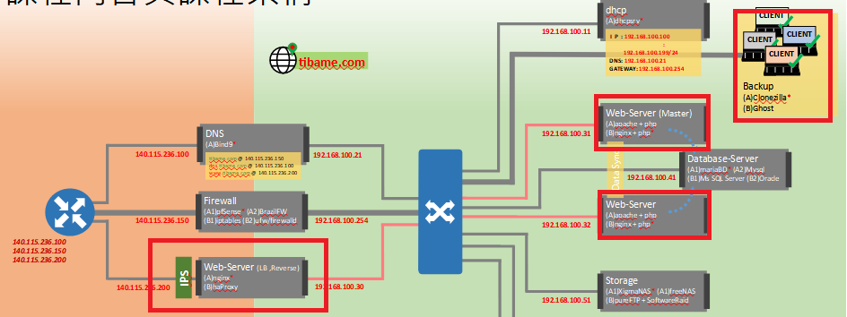

### 環境
>
frontend webserver: 192.168.211.200
backend webserver: 192.168.100.31, 192.168.100.32
test: jmeter
OS: ubuntu 20.04

### haproxy

安裝 haproxy
```
apt install haproxy
```

編輯組態檔，
vim /etc/haproxy/haproxy.cfg 最後面加上:
```
# 前端轉送的設定
frontend example_front_end
    bind *:80
    option forwardfor  
    default_backend web_servers    

# 轉發的後端服務
backend web_servers
    balance roundrobin
    server server-1 192.168.100.31:80 check
    server server-2 192.168.100.32:80 check

# 查看伺服器效能
listen stats
    bind :32600
    stats enable
    stats uri /
    stats hide-version
    stats auth root:123456
```

重新啟動 haproxy
```
service haproxy restart
```


### 用 jmeter 做壓力測試

安裝並執行
```
apt install openjdk-11-jdk

wget https://dlcdn.apache.org//jmeter/binaries/apache-jmeter-5.4.1.zip

unzip apache-jmeter-5.4.1.zip

cd apache-jmeter-5.4.1/bin

./jmeter

```

Test Plan (按右鍵)-> add -> Threads (Users) ->Thread Group
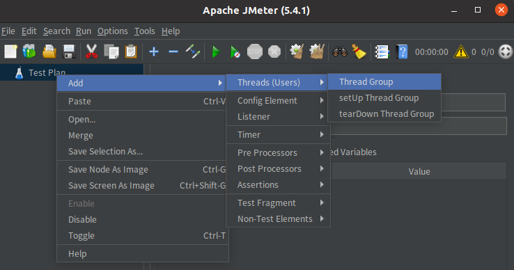
模擬 1000個使用者執行次
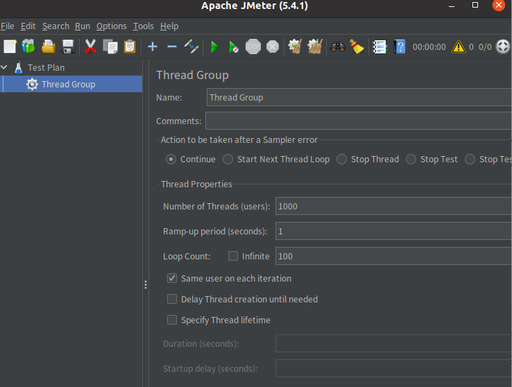
Test Plan (按右鍵)-> add -> Sampler -> HTTP Request
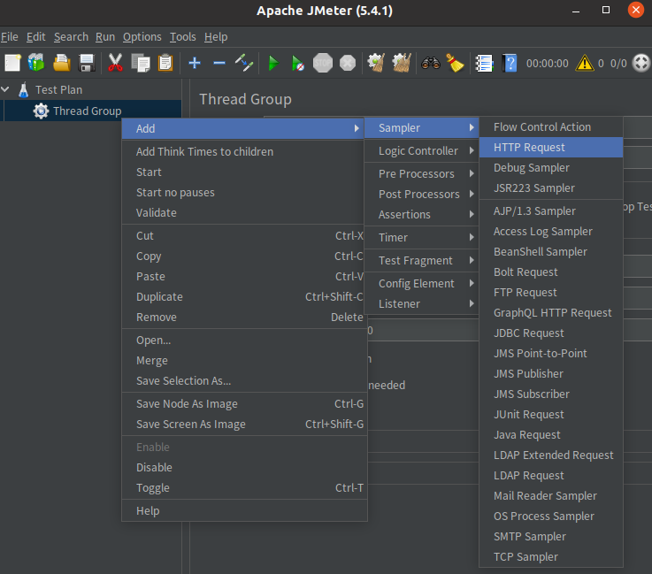
測試IP:192.168.211.200
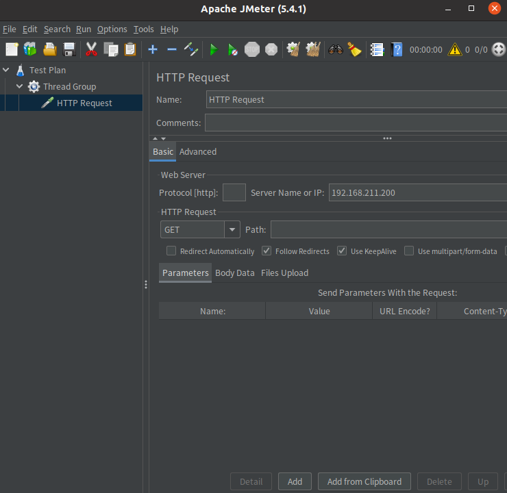
Test Plan (按右鍵)-> add -> Listener -> View Results Tree
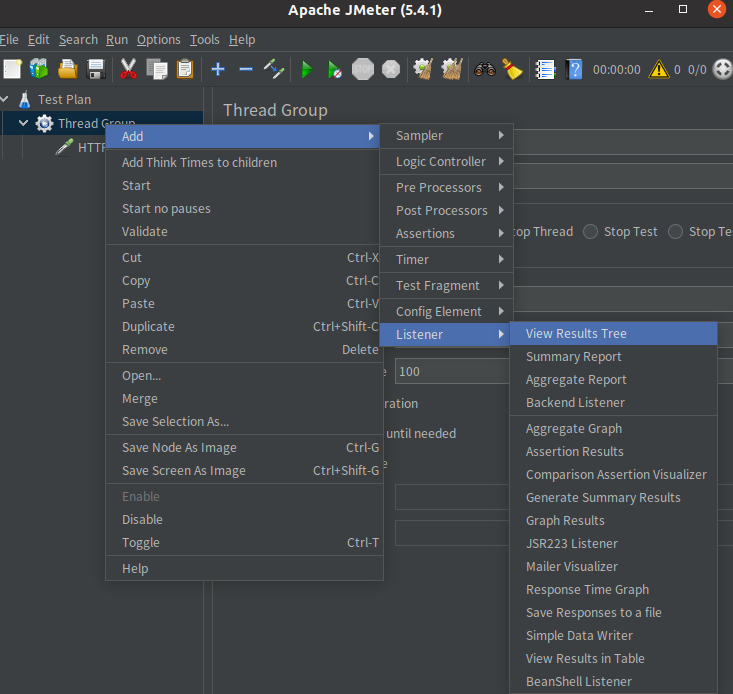
開始測試

設定 jmeter 測試計畫檔(.jmx)位置
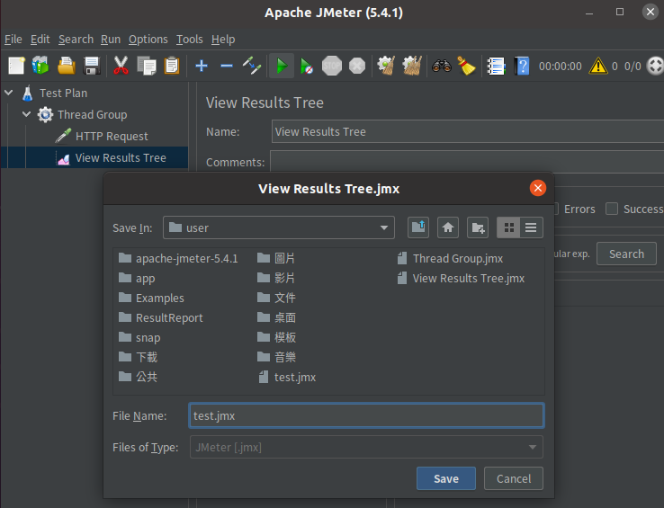
測試中
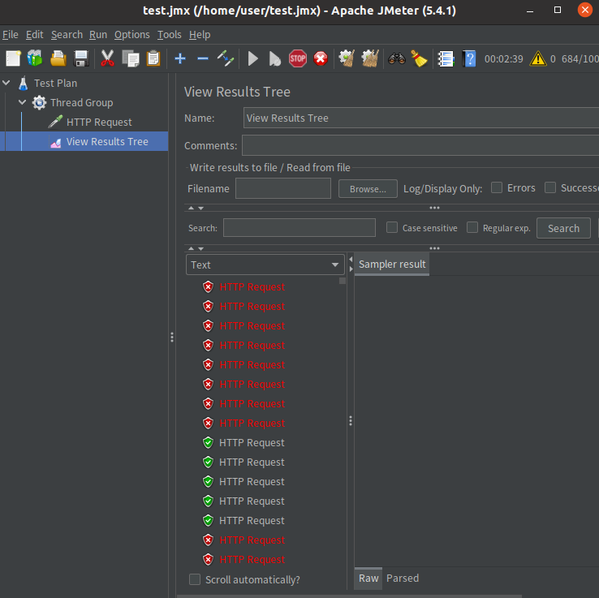
測試完成
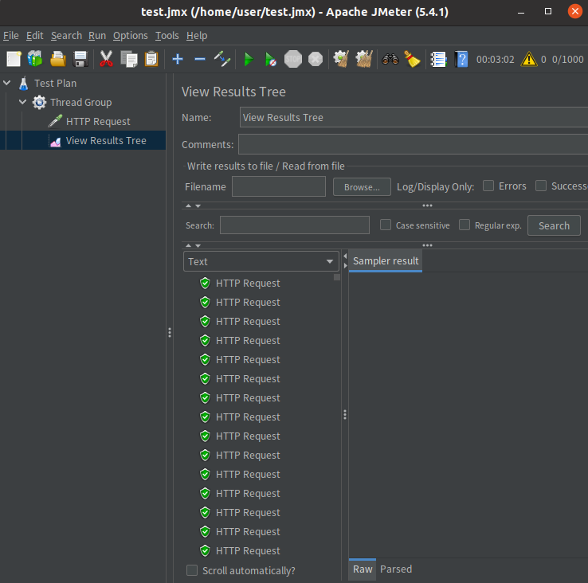


產生測試報告
```
# 清除之前執行過的檔案
rm -rf /home/user/result.jtl
rm -rf /home/user/ResultReport

# 產生測試報告(沒有.jtl檔案)
/home/user/apache-jmeter-5.4.1/bin/jmeter -n -t /home/user/test.jmx -l /home/user/result.jtl -e -o /home/user/ResultReport

# 產生測試報告(有.jtl檔案)
/home/user/apache-jmeter-5.4.1/bin/jmeter -g /home/user/result.jtl -o /home/user/ResultReport
```


測試報告首頁
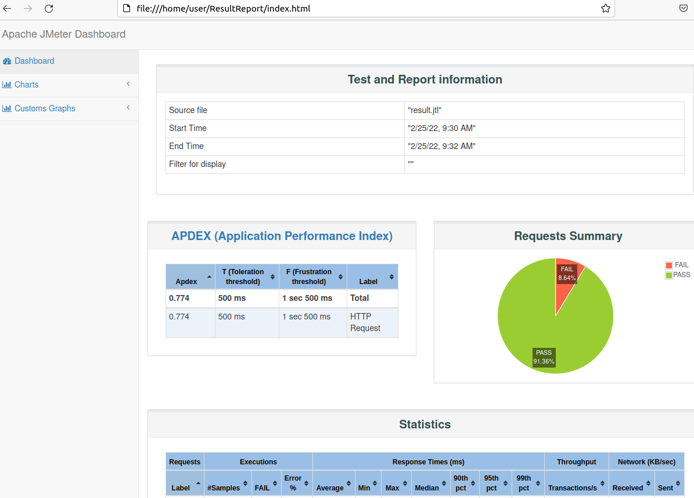
可以選擇想看的圖表
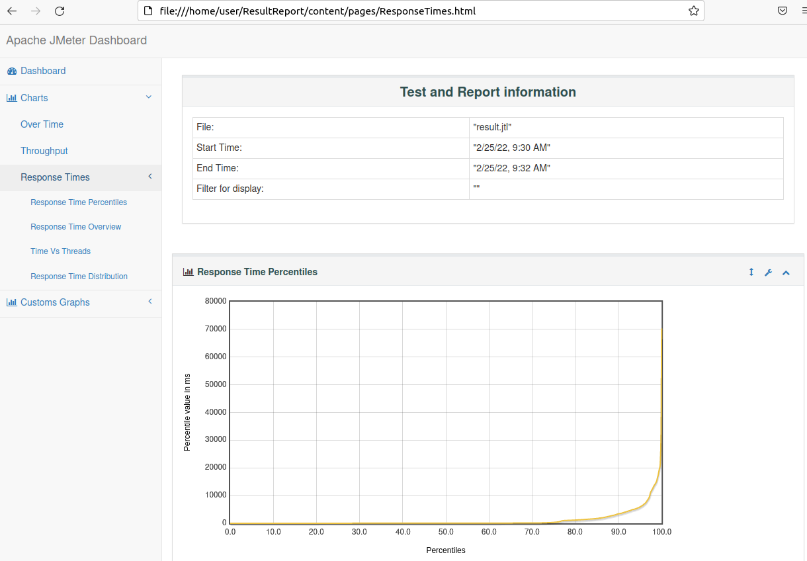
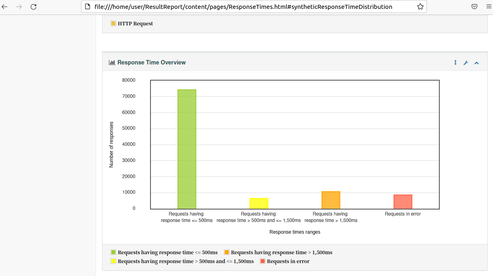

jmeter 測試計畫檔(.jmx)
[test.jmx](./assets/test.jmx)

jmeter 測試結果(xxx.jtl)
[result.jtl](./assets/result.jtl)

jmeter 測試報告
[index.html](./assets/ResultReport/index.html)


-----


haproxy 監控工具，可以即時看到 HAPRoxy 的狀態


用高流量讓網站壞掉
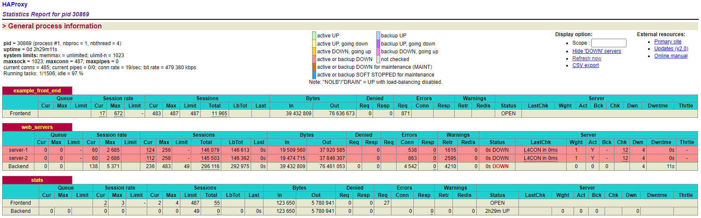

關掉 web1 ，web2 流量都導入 web2
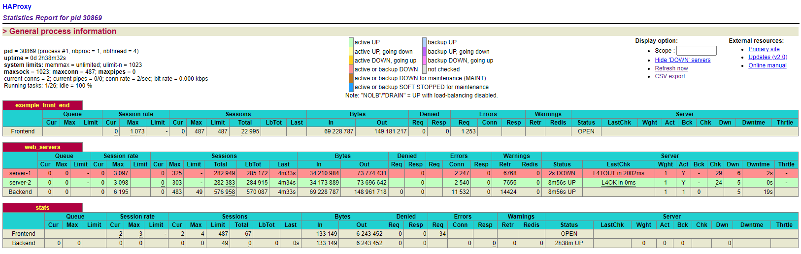


-----

### online

[this](https://github.com/rockexe0000/HAProxy)

-----
### 參考

[如何在 Ubuntu 20.04 上安裝 HAProxy](https://www.vultr.com/docs/how-to-install-haproxy-on-ubuntu-20-04/)

[HAproxy的安裝設定及範例](https://tw511.com/a/01/6959.html)

[【HAProxy】HAProxy原理和基本概念|负载均衡HAProxy的日志配置策略](https://blog.51cto.com/liangchaoxi/4051119)


[如何在 Ubuntu 20.04 上下載和安裝 Apache JMeter](https://linoxide.com/install-apache-jmeter-on-ubuntu/)


[Linux之實訓篇——haproxy配置負載均衡及訪問控制](https://www.itread01.com/content/1550005576.html)

[## IT｜軟體｜測試｜JMeter 自動生成測試報告](https://ithelp.ithome.com.tw/articles/10194368)


